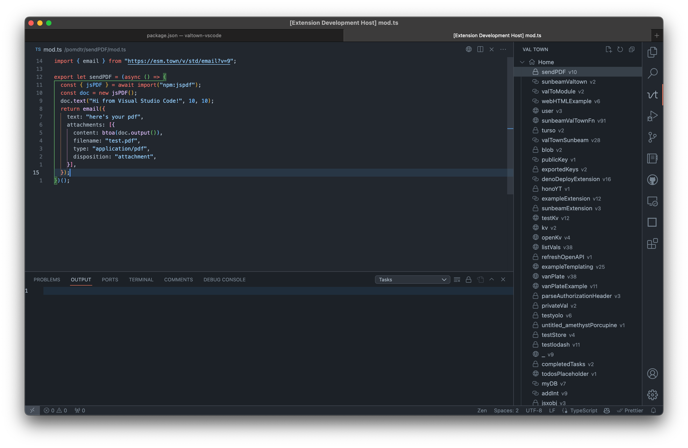

# Val Town - VS Code Integration



## Installation

```sh
npm install -g @vscode/vsce # if you don't have it already
npm install # install dependencies
vsce package # generate .vsix file
code --install-extension valtown-0.0.1.vsix # install extension
```
